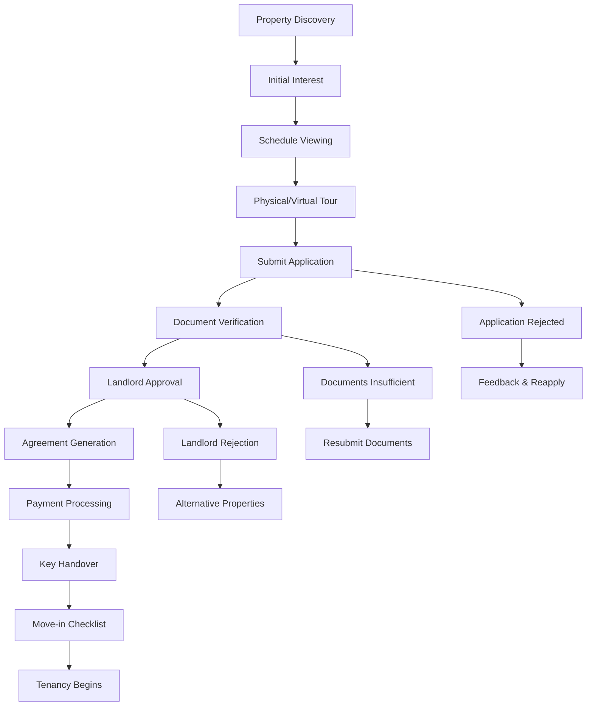

# 🏠 JulaazNG
## Comprehensive Product Requirements Document (PRD)

---
## 1. Executive Summary

### 1.1 Vision Statement
To revolutionize Nigeria's property rental market by creating a comprehensive, trust-based platform that connects landlords, tenants, and service providers while ensuring transparency, security, and exceptional user experience.

### 1.2 Product Overview
JulaazNG is a mobile-first web application that serves as Nigeria's premier property rental and services marketplace, offering long-term rentals, short-term stays (Airbnb-style), cleaning services, and moving solutions with integrated property management capabilities.

### 1.3 Target Market
- **Primary**: Lagos State, Nigeria (15M+ residents, 60% renters)
- **Secondary**: Abuja, Port Harcourt, Ibadan (Phase 2)
- **Tertiary**: Nationwide expansion (Post-launch)
- **Users**: Property seekers, landlords, service providers, property managers

### 1.4 Key Success Metrics
- Monthly Active Users (MAU): 10,000+ within 6 months
- Monthly Transactions: 500+ rental agreements, 1,000+ service bookings
- Platform Revenue: ₦5M+ monthly within first year
- User Satisfaction: 4.5+ star average rating
- Property Listings: 1,000+ verified properties within 3 months
- Service Provider Network: 200+ verified providers

---

## 2. Product Objectives & Strategy

### 2.1 Primary Goals
1. **Streamline Property Discovery**: Enable efficient property search and booking
2. **Build Trust**: Comprehensive verification and rating systems
3. **Reduce Friction**: Minimize direct landlord-tenant interactions
4. **Generate Revenue**: Sustainable commission-based business model
5. **Scale Nationwide**: Expandable architecture for multiple cities

### 2.2 Core Value Propositions
1. **Trust & Security**: Comprehensive verification for all users
2. **Convenience**: One-stop platform for rentals and services
3. **Transparency**: Clear pricing, standardized agreements
4. **Efficiency**: Streamlined booking and payment processes
5. **Support**: 24/7 customer service and dispute resolution

### 2.3 Product Pillars
- **Rental Management**: Long-term and short-let property rentals
- **Service Marketplace**: Cleaning, moving, and maintenance services
- **Trust Framework**: Verification, reviews, and dispute resolution
- **Payment Infrastructure**: Secure, integrated payment processing
- **Property Management Suite**: Comprehensive landlord tools

### 2.4 User Personas

#### 2.4.1 Tenants
- **Demographics:** Ages 22-45, working professionals, students, families
- **Pain Points:** Fraudulent listings, high agent fees, poor property conditions
- **Needs:** Verified properties, transparent pricing, convenient booking

#### 2.4.2 Landlords
- **Demographics:** Property owners, real estate investors
- **Pain Points:** Tenant screening, rent collection, property maintenance
- **Needs:** Verified tenants, automated rent collection, maintenance services

#### 2.4.3 Service Providers
- **Demographics:** Cleaning services, moving companies, handymen
- **Pain Points:** Customer acquisition, payment delays, booking management
- **Needs:** Steady customer flow, secure payments, scheduling tools

---

## 3. Product Vision & Strategy

### 3.1 Core Value Propositions
1. **Trust & Security:** Comprehensive verification for all users
2. **Convenience:** One-stop platform for rentals and services
3. **Transparency:** Clear pricing, standardized agreements
4. **Efficiency:** Streamlined booking and payment processes
5. **Support:** 24/7 customer service and dispute resolution

### 3.2 Product Pillars
- **Rental Management:** Long-term and short-let property rentals
- **Service Marketplace:** Cleaning, moving, and labor services
- **Trust Framework:** Verification, reviews, and dispute resolution
- **Payment Infrastructure:** Secure, integrated payment processing

---

## 4. Business Model & Monetization

### 4.1 Revenue Streams
1. **Signing Fees:** Fixed fee on successful rental agreements (₦5,000-₦15,000)
2. **Commission on Rent:** 2-5% commission on monthly rent payments
3. **Service Booking Fees:** 10-15% commission on service bookings
4. **Premium Listings:** Enhanced visibility for properties (₦2,000-₦10,000/month)
5. **Full-Service Management:** Optional property management (8-12% of rent)

### 4.2 Pricing Strategy
- **Tenant Registration:** Free
- **Landlord Basic Listing:** Free (with JulaazNG branding)
- **Premium Features:** Tiered pricing model
- **Service Provider Registration:** Free (commission-based)

### 4.3 Payment Integration
- **Primary:** Paystack (Nigerian market leader)
- **Secondary:** Flutterwave (backup and comparison)
- **Supported Methods:** Cards, bank transfers, USSD, mobile money

### 4.4 Pricing Strategy & Justification

#### **Why Commission-Based Ranges?**

**Market-Competitive Positioning:**
- Traditional Nigerian estate agents charge 10-15% commission
- JulaazNG offers 5-8% rental commission = 30-50% cost savings for landlords
- Competitive advantage while maintaining profitability

**Value-Based Pricing Structure:**
- **5%**: High-volume properties, premium landlords, bulk portfolios
- **8%**: Single properties, new landlords, high-maintenance properties
- Flexibility allows negotiation based on property value and landlord relationship

#### **Detailed Revenue Justification**

**1. Rental Commission (5-8% of annual rent)**
```
Example Property: ₦2,000,000/year rent
JulaazNG Commission at 6%: ₦120,000
Traditional Agent: ₦200,000-300,000
Landlord Savings: ₦80,000-180,000 (40-60% savings)
```

**Market Logic:**
- **Volume Strategy**: Lower rates attract more landlords
- **Technology Advantage**: Automated processes reduce operational costs
- **Trust Premium**: Verified platform justifies commission over direct deals

**2. Service Fees (10-15% of service bookings)**
```
Example Cleaning Service: ₦50,000
JulaazNG Fee at 12%: ₦6,000
Service Provider Receives: ₦44,000
Customer Pays: ₦50,000 (same as direct booking)
```

**Justification:**
- **Standard Platform Fee**: Similar to Uber (15-20%), but more affordable
- **Value Addition**: Insurance, quality assurance, dispute resolution included
- **Service Provider Benefits**: Marketing, customer acquisition, payment processing

**3. Short-let Commission (3-5% per booking)**
```
7-day Short-let: ₦200,000
JulaazNG Commission at 4%: ₦8,000
Monthly Potential: ₦32,000 (4 bookings)
Annual Revenue per Property: ₦384,000
```

**Strategy Rationale:**
- **Higher Volume**: More frequent bookings than long-term rentals
- **Market Competition**: Airbnb charges 3% (host) + 14% (guest)
- **Quick Turnover**: Faster revenue generation cycle

**4. Property Management (8-12% of monthly rent)**
```
Monthly Rent: ₦500,000
JulaazNG Management Fee at 10%: ₦50,000
Annual Management Revenue: ₦600,000 per property
```

**Industry Comparison:**
- **Traditional Property Managers**: 10-15% in Nigeria
- **JulaazNG Advantage**: Technology-driven efficiency at lower cost
- **Optional Service**: Landlords can opt-out, but most prefer hassle-free management

#### **Revenue Projections**

**Year 1 (Lagos Only)**
```
Properties: 500 listings
Average Rent: ₦2,500,000/year
Commission Rate: 6%
Rental Revenue: 500 × ₦2,500,000 × 6% = ₦75,000,000

Services: 200 bookings/month
Average Service: ₦75,000
Commission: 12%
Service Revenue: 200 × ₦75,000 × 12% × 12 = ₦21,600,000

Total Year 1 Revenue: ₦96,600,000 (~$207,000)
```

**Year 3 (Nationwide)**
```
Properties: 3,000 listings
Services: 1,000 bookings/month
Property Management: 40% adoption rate
Projected Annual Revenue: ₦500,000,000+ (~$1.07M)
```

#### **Market Adaptation Strategy**

**Phase 1: Market Entry (Months 1-6)**
- **Aggressive Pricing**: 5% rental, 10% services
- **Customer Acquisition**: Focus on volume over margin
- **Trust Building**: Prove value proposition

**Phase 2: Market Development (Months 7-12)**
- **Standard Pricing**: 6% rental, 12% services
- **Service Expansion**: Add property management
- **Premium Tiers**: Introduce higher-value services

**Phase 3: Market Leadership (Year 2+)**
- **Optimized Pricing**: 7-8% rental, 15% services
- **Premium Services**: Insurance, legal, financing
- **Market Expansion**: Replicate model in other cities

#### **Nigerian Market Considerations**

**Price Sensitivity Factors:**
- **Gradual Introduction**: Start lower, increase as value is proven
- **Bundle Discounts**: Multiple services = lower overall rates
- **Loyalty Programs**: Long-term partners get better rates

**Regional Flexibility:**
- **Lagos Premium**: Higher rates for prime locations
- **Secondary Cities**: Lower rates for emerging markets
- **Economic Adaptation**: Adjust during economic fluctuations

**Competitive Differentiation:**
- **Technology Integration**: Automated processes reduce costs
- **Transparency**: No hidden fees builds market trust
- **Value Addition**: Comprehensive services justify commission rates

---

## 5. Product Features & Requirements

### 5.1 Core Features

#### 5.1.1 User Management
- **Registration & Authentication**
  - Email/phone number signup
  - OTP verification
  - Social login (Google, Facebook)
  - Multi-factor authentication for payments

- **Profile Management**
  - Personal information
  - Verification status
  - Preferences and settings
  - Document uploads

#### 5.1.2 Property Management
- **Property Listings**
  - Detailed property information
  - Photo/video galleries
  - Virtual tour integration
  - Amenity checklists
  - Pricing and availability
  - Neighborhood information

- **Search & Discovery**
  - Advanced filtering (price, location, type, amenities)
  - Map-based search
  - Saved searches and alerts
  - Nearby landmarks integration
  - Recommended properties
  - Proximity to landmarks (bus stops, train stations)
  - Custom saved searches with alerts

#### 5.1.3 Booking System
- **Rental Booking**
  - Viewing appointment scheduling
  - Application submission
  - Document upload
  - Agreement signing
  - Payment processing

- **Service Booking**
  - Service category selection
  - Provider matching
  - Scheduling system
  - Recurring booking options
  - Real-time tracking

#### 5.1.4 Short-let Module (Airbnb-style)

###### Features
- **Instant Booking**: Pre-approved properties
- **Flexible Dates**: Calendar-based availability
- **Guest Screening**: ID verification for bookings
- **House Rules**: Property-specific guidelines
- **Check-in/Check-out**: Digital key management
- **Guest Services**: 24/7 support during stay

###### Pricing Model
- Dynamic pricing based on demand
- Seasonal adjustments
- Weekend/holiday premiums
- Minimum stay requirements

#### 5.1.5 Service Provider Network

###### Cleaning Services
- **Service Types**
  - Move-in/move-out cleaning
  - Regular house cleaning
  - Deep cleaning services
  - Post-construction cleaning
  - Carpet and upholstery cleaning

- **Booking System**
  - Instant booking for available slots
  - Recurring service scheduling
  - Custom service packages
  - Real-time service tracking

###### Moving Services
- **Lorry Rental**
  - Vehicle size selection
  - Hourly/daily rates
  - GPS tracking
  - Insurance coverage

- **Labor Services**
  - Packing and unpacking
  - Furniture assembly/disassembly
  - Loading and unloading
  - Carton supply


#### 5.1.6 Communication
- **Messaging System**
  - In-app chat
  - Push notifications
  - Email notifications
  - WhatsApp integration
  - Video call scheduling

#### 5.1.7 Payment System
- **Rent Collection**
  - Automated monthly collection
  - Payment reminders
  - Late fee calculation
  - Receipt generation
  - Dispute handling

- **Service Payments**
  - Escrow system
  - Instant payments
  - Refund processing
  - Commission tracking

### 5.2 Advanced Features

#### 5.2.1 Identity Verification
- **Required Documents**
  - National Identification Number (NIN)
  - International Passport
  - Driver's License
  - Voter's Card (alternative)

#### 5.2.2 Financial Verification
- **For Tenants**
  - Bank statements (3-6 months)
  - Employment verification letter
  - Salary slips
  - Previous rent receipts

- **For Landlords**
  - Property ownership documents
  - Certificate of Occupancy (C of O)
  - Tax clearance certificates
  - Utility bills

#### 5.2.3 Service Provider Verification
- **Background Checks**
  - Criminal background verification
  - Professional references
  - Insurance verification
  - Skill assessment tests

#### 5.2.4 Review & Rating System
- **Bidirectional Reviews**
  - Tenant reviews of properties/landlords
  - Landlord reviews of tenants
  - Service provider ratings
  - Photo/video reviews
  - Response system

#### 5.2.5 Dispute Resolution
- **Automated Resolution**
  - Common issue templates
  - Evidence submission
  - Timeline tracking
  - Communication facilitation

- **Legal Support**
  - Legal expert consultation
  - Document review
  - Mediation services
  - Arbitration options

### 5.3 Service Categories

#### 5.3.1 Cleaning Services
- **Residential Cleaning**
  - Regular housekeeping
  - Deep cleaning
  - Move-in/move-out cleaning
  - Specialized cleaning (carpet, window)

#### 5.3.2 Moving Services
- **Lorry Rental**
  - Vehicle size options
  - Driver inclusion
  - Distance-based pricing
  - Insurance coverage

- **Labor Services**
  - Packing/unpacking
  - Loading/unloading
  - Furniture assembly
  - Temporary storage

## 6. Localization & Accessibility

### Multi-Language Support
- **Primary**: English (Nigerian English)
- **Secondary**: Yoruba, Hausa, Igbo
- **Features**
  - Dynamic language switching
  - Currency localization (₦)
  - Date/time formatting

### Accessibility Features
- **WCAG 2.1 AA Compliance**
- **Screen Reader Support**
- **Keyboard Navigation**
- **High Contrast Mode**
- **Font Size Adjustment**

---

## 7. User Experience Design

### 7.1 Mobile-First Approach
- **Responsive Design**: Seamless experience across devices
- **Touch-Friendly**: Optimized for touch interactions
- **Fast Loading**: Optimized images and lazy loading
- **Offline Capability**: Basic functionality without internet

### 7.2 Key UX Principles
1. **Simplicity**: Intuitive navigation and clear CTAs
2. **Trust**: Transparent information and verification badges
3. **Efficiency**: Minimal steps to complete actions
4. **Feedback**: Clear status updates and confirmations
5. **Accessibility**: Inclusive design for all users
---

### 7.3 Theme Architecture

```typescript
interface Theme {
  id: string;
  name: string;
  displayName: string;
  type: 'light' | 'dark';
  colors: {
    // Base colors
    primary: string;
    primaryForeground: string;
    secondary: string;
    secondaryForeground: string;
    
    // Background colors
    background: string;
    foreground: string;
    card: string;
    cardForeground: string;
    
    // UI colors
    muted: string;
    mutedForeground: string;
    accent: string;
    accentForeground: string;
    
    // Semantic colors
    destructive: string;
    destructiveForeground: string;
    success: string;
    successForeground: string;
    warning: string;
    warningForeground: string;
    
    // Interactive colors
    border: string;
    input: string;
    ring: string;
  };
  gradients?: {
    primary: string;
    secondary: string;
    accent: string;
  };
  shadows?: {
    sm: string;
    md: string;
    lg: string;
    xl: string;
  };
}
```

- **Theme Support:** 6 themes (Naija Fresh, Eko Luxe, Arewa Calm, Ụlọ Oma, Rainy 9ja, Ajébo Blend)
- **Responsive Design:** Mobile-first approach
- **Accessibility:** WCAG 2.1 AA compliance
- **Performance:** Core Web Vitals optimization
- **PWA Features:** Offline support, push notifications

### 7.4 Available Themes

#### 7.4.1 🌞 Naija Fresh (Default)
```css
[data-theme="naija-fresh"] {
  --background: #f7f9f7;
  --foreground: #1e1e1e;
  --primary: #00a754;
  --primary-foreground: #ffffff;
  --secondary: #e3f5e9;
  --secondary-foreground: #1e1e1e;
  --accent: #019863;
  --accent-foreground: #ffffff;
  --border: #dfe7e2;
  --muted: #f1f5f3;
  --muted-foreground: #666;
  --destructive: #ff4d4f;
  --success: #22c55e;
  --warning: #f59e0b;
  --input: #dfe7e2;
  --ring: #00a754;
}
```

#### 7.4.2 🌃 Eko Luxe
```css
[data-theme="eko-luxe"] {
  --background: #0d1f23;
  --foreground: #ffffff;
  --primary: #00a754;
  --primary-foreground: #ffffff;
  --secondary: #152b27;
  --secondary-foreground: #d1d5db;
  --accent: #019863;
  --accent-foreground: #ffffff;
  --border: #1f3332;
  --muted: #1e2d2c;
  --muted-foreground: #a3a3a3;
  --destructive: #ff4d4f;
  --success: #4ade80;
  --warning: #fbbf24;
  --input: #243c39;
  --ring: #019863;
}
```

#### 7.4.3 🏜️ Arewa Calm
```css
[data-theme="arewa-calm"] {
  --background: #f8f4e5;
  --foreground: #3f3a2d;
  --primary: #a77e00;
  --primary-foreground: #ffffff;
  --secondary: #d3c8ae;
  --secondary-foreground: #3f3a2d;
  --accent: #00a754;
  --accent-foreground: #ffffff;
  --border: #d1c7a8;
  --muted: #ece5d4;
  --muted-foreground: #595959;
  --destructive: #b91c1c;
  --success: #15803d;
  --warning: #f59e0b;
  --input: #e7e0c3;
  --ring: #a77e00;
}
```

#### 7.4.4 🏠 Ụlọ Oma
```css
[data-theme="ulo-oma"] {
  --background: #fef9f4;
  --foreground: #1a1a1a;
  --primary: #d42f2f;
  --primary-foreground: #ffffff;
  --secondary: #e3d8c9;
  --secondary-foreground: #1a1a1a;
  --accent: #019863;
  --accent-foreground: #ffffff;
  --border: #dfd6c3;
  --muted: #f6f1e9;
  --muted-foreground: #666;
  --destructive: #b91c1c;
  --success: #16a34a;
  --warning: #eab308;
  --input: #e8dfd1;
  --ring: #d42f2f;
}
```

#### 7.4.5 🌧️ Rainy 9ja
```css
[data-theme="rainy-9ja"] {
  --background: #0f172a;
  --foreground: #e2e8f0;
  --primary: #0284c7;
  --primary-foreground: #ffffff;
  --secondary: #1e293b;
  --secondary-foreground: #cbd5e1;
  --accent: #00a754;
  --accent-foreground: #ffffff;
  --border: #1e293b;
  --muted: #334155;
  --muted-foreground: #94a3b8;
  --destructive: #ef4444;
  --success: #10b981;
  --warning: #facc15;
  --input: #1e293b;
  --ring: #0284c7;
}
```

#### 7.4.6 🎨 Ajébo Blend
```css
[data-theme="ajebo-blend"] {
  --background: #111827;
  --foreground: #f3f4f6;
  --primary: #9333ea;
  --primary-foreground: #ffffff;
  --secondary: #1f2937;
  --secondary-foreground: #d1d5db;
  --accent: #00a754;
  --accent-foreground: #ffffff;
  --border: #374151;
  --muted: #1f2937;
  --muted-foreground: #9ca3af;
  --destructive: #f87171;
  --success: #34d399;
  --warning: #fbbf24;
  --input: #1f2937;
  --ring: #9333ea;
}
```

### 7.5 Theme Management System

```typescript
// Theme Context
interface ThemeContextType {
  theme: string;
  setTheme: (theme: string) => void;
  themes: Theme[];
  systemTheme: 'light' | 'dark';
}

// Theme Provider Implementation
export const ThemeProvider: React.FC<{ children: React.ReactNode }> = ({ children }) => {
  const [theme, setTheme] = useState<string>(() => {
    return localStorage.getItem('julaaz-theme') || 'naija-fresh';
  });

  const [systemTheme, setSystemTheme] = useState<'light' | 'dark'>(() => {
    return window.matchMedia('(prefers-color-scheme: dark)').matches ? 'dark' : 'light';
  });

  useEffect(() => {
    localStorage.setItem('julaaz-theme', theme);
    document.documentElement.setAttribute('data-theme', theme);
  }, [theme]);

  return (
    <ThemeContext.Provider value={{ theme, setTheme, themes: AVAILABLE_THEMES, systemTheme }}>
      {children}
    </ThemeContext.Provider>
  );
};

// Theme Selector Component
export const ThemeSelector = () => {
  const { theme, setTheme, themes } = useTheme();

  return (
    <Select value={theme} onValueChange={setTheme}>
      <SelectTrigger className="w-[180px]">
        <SelectValue placeholder="Select theme" />
      </SelectTrigger>
      <SelectContent>
        {themes.map((t) => (
          <SelectItem key={t.id} value={t.id}>
            <div className="flex items-center gap-2">
              <div 
                className="w-4 h-4 rounded-full border"
                style={{ backgroundColor: t.colors.primary }}
              />
              {t.displayName}
            </div>
          </SelectItem>
        ))}
      </SelectContent>
    </Select>
  );
};
```

---

## 8. Core Features & Functionality

### 8.1 User Management System

#### 8.1.1 Registration & Authentication

```typescript
// User Registration Flow
interface UserRegistrationData {
  email: string;
  phone: string;
  firstName: string;
  lastName: string;
  userType: 'tenant' | 'landlord' | 'service_provider';
  password: string;
  referralCode?: string;
}

// Authentication Methods
enum AuthMethod {
  EMAIL_PASSWORD = 'email_password',
  GOOGLE = 'google',
  FACEBOOK = 'facebook',
  PHONE_OTP = 'phone_otp'
}

// Multi-Factor Authentication
interface MFAConfig {
  enabled: boolean;
  methods: ('sms' | 'email' | 'authenticator')[];
  backupCodes: string[];
}
```

#### 8.1.2 Profile Management

```typescript
// User Profile Schema
interface UserProfile {
  id: string;
  personalInfo: {
    firstName: string;
    lastName: string;
    email: string;
    phone: string;
    dateOfBirth?: Date;
    gender?: 'male' | 'female' | 'other';
    nationality: string;
    profileImage?: string;
  };
  
  address: {
    street: string;
    city: string;
    state: string;
    country: string;
    postalCode?: string;
    coordinates?: {
      latitude: number;
      longitude: number;
    };
  };
  
  verification: {
    status: 'pending' | 'verified' | 'rejected';
    documents: VerificationDocument[];
    verifiedAt?: Date;
    verifiedBy?: string;
  };
  
  preferences: {
    language: 'en' | 'yo' | 'ha' | 'ig';
    currency: 'NGN' | 'USD';
    notifications: NotificationPreferences;
    theme: string;
  };
  
  settings: {
    privacy: PrivacySettings;
    security: SecuritySettings;
    communication: CommunicationSettings;
  };
}
```

### 8.2 Property Management System

#### 8.2.1 Property Listing Structure

```typescript
// Comprehensive Property Schema
interface Property {
  id: string;
  landlordId: string;
  
  // Basic Information
  title: string;
  description: string;
  propertyType: 'apartment' | 'house' | 'duplex' | 'studio' | 'penthouse' | 'bungalow';
  rentalType: 'long_term' | 'short_let' | 'both';
  
  // Physical Details
  specifications: {
    bedrooms: number;
    bathrooms: number;
    toilets: number;
    areaSqm: number;
    floorNumber?: number;
    totalFloors?: number;
    yearBuilt?: number;
    furnished: 'unfurnished' | 'semi_furnished' | 'fully_furnished';
  };
  
  // Location
  location: {
    address: string;
    city: string;
    state: string;
    country: string;
    postalCode?: string;
    coordinates: {
      latitude: number;
      longitude: number;
    };
    landmarks: string[];
    neighborhood: string;
  };
  
  // Pricing
  pricing: {
    rentAmount: number;
    currency: 'NGN' | 'USD';
    paymentFrequency: 'monthly' | 'quarterly' | 'annually';
    additionalCosts: {
      securityDeposit: number;
      agentFee: number;
      legalFee: number;
      maintenanceFee?: number;
    };
    utilities: {
      electricity: 'included' | 'separate' | 'shared';
      water: 'included' | 'separate' | 'shared';
      gas: 'included' | 'separate' | 'shared' | 'none';
      internet: 'included' | 'separate' | 'none';
    };
  };
  
  // Media
  media: {
    images: PropertyImage[];
    videos: PropertyVideo[];
    virtualTour?: string;
    floorPlan?: string;
  };
  
  // Amenities
  amenities: {
    interior: string[];
    exterior: string[];
    building: string[];
    neighborhood: string[];
  };
  
  // Availability
  availability: {
    status: 'available' | 'rented' | 'maintenance' | 'inactive';
    availableFrom: Date;
    minimumStay?: number; // days
    maximumStay?: number; // days
    calendar?: AvailabilityCalendar; // for short-let
  };
  
  // Verification
  verification: {
    status: 'pending' | 'verified' | 'rejected';
    documents: PropertyDocument[];
    inspectionDate?: Date;
    inspectorId?: string;
    verificationNotes?: string;
  };
  
  // Metadata
  metadata: {
    createdAt: Date;
    updatedAt: Date;
    views: number;
    inquiries: number;
    bookings: number;
    featured: boolean;
    premium: boolean;
  };
}
```

#### 8.2.2 Advanced Search & Filtering

```typescript
// Search Query Interface
interface PropertySearchQuery {
  // Location filters
  location?: {
    city?: string;
    state?: string;
    neighborhood?: string;
    radius?: number; // km
    coordinates?: {
      latitude: number;
      longitude: number;
    };
  };
  
  // Property filters
  propertyType?: PropertyType[];
  rentalType?: RentalType[];
  priceRange?: {
    min: number;
    max: number;
    currency: string;
  };
  
  // Specifications
  bedrooms?: {
    min?: number;
    max?: number;
  };
  bathrooms?: {
    min?: number;
    max?: number;
  };
  areaSqm?: {
    min?: number;
    max?: number;
  };
  
  // Amenities
  amenities?: string[];
  furnished?: FurnishedType[];
  
  // Availability
  availableFrom?: Date;
  availableTo?: Date;
  
  // Sorting
  sortBy?: 'price_asc' | 'price_desc' | 'date_desc' | 'relevance' | 'distance';
  
  // Pagination
  page?: number;
  limit?: number;
  
  // Advanced filters
  verified?: boolean;
  featured?: boolean;
  newListings?: boolean; // last 7 days
  priceReduced?: boolean;
}

// Search Result Interface
interface PropertySearchResult {
  properties: Property[];
  pagination: {
    currentPage: number;
    totalPages: number;
    totalCount: number;
    hasNext: boolean;
    hasPrevious: boolean;
  };
  filters: {
    appliedFilters: PropertySearchQuery;
    availableFilters: {
      priceRange: { min: number; max: number };
      locations: string[];
      amenities: string[];
      propertyTypes: PropertyType[];
    };
  };
  suggestions?: string[];
}
```

### 8.3 Booking System

#### 8.3.1 Rental Booking Flow



#### 8.3.2 Booking Management

```typescript
// Booking Interface
interface Booking {
  id: string;
  propertyId: string;
  tenantId: string;
  landlordId: string;
  
  // Booking Details
  type: 'rental' | 'short_let';
  startDate: Date;
  endDate?: Date; // null for long-term rentals
  
  // Status Management
  status: 'pending' | 'viewing_scheduled' | 'application_submitted' | 
          'documents_pending' | 'under_review' | 'approved' | 
          'agreement_sent' | 'payment_pending' | 'confirmed' | 
          'active' | 'completed' | 'cancelled' | 'rejected';
  
  // Application Data
  application: {
    submittedAt: Date;
    personalInfo: TenantPersonalInfo;
    employmentInfo: TenantEmploymentInfo;
    references: TenantReference[];
    documents: TenantDocument[];
    questionnaire: PropertyQuestionnaire;
  };
  
  // Viewing Details
  viewingSchedule?: {
    scheduledAt: Date;
    type: 'physical' | 'virtual';
    status: 'scheduled' | 'completed' | 'cancelled' | 'rescheduled';
    attendees: string[];
    notes?: string;
  };
  
  // Financial Details
  payment: {
    rentAmount: number;
    securityDeposit: number;
    agentFee: number;
    legalFee: number;
    totalAmount: number;
    currency: string;
    paymentMethod?: PaymentMethod;
    paymentStatus: 'pending' | 'processing' | 'completed' | 'failed';
    transactions: PaymentTransaction[];
  };
  
  // Agreement
  agreement?: {
    templateId: string;
    generatedAt: Date;
    signedBy: {
      tenant: { signedAt?: Date; ipAddress?: string };
      landlord: { signedAt?: Date; ipAddress?: string };
    };
    documentUrl: string;
    terms: AgreementTerms;
  };
  
  // Timeline
  timeline: BookingTimelineEvent[];
  
  // Metadata
  createdAt: Date;
  updatedAt: Date;
  completedAt?: Date;
  cancelledAt?: Date;
  cancellationReason?: string;
}
```

### 8.4 Service Provider Network

#### 8.4.1 Service Categories & Structure

```typescript
// Service Categories
enum ServiceCategory {
  CLEANING = 'cleaning',
  MOVING = 'moving',
  MAINTENANCE = 'maintenance',
  SECURITY = 'security',
  UTILITIES = 'utilities'
}

// Service Types
interface ServiceType {
  id: string;
  category: ServiceCategory;
  name: string;
  description: string;
  basePrice: number;
  priceUnit: 'hour' | 'room' | 'sqm' | 'fixed' | 'day';
  duration: number; // minutes
  requirements: string[];
  materials: ServiceMaterial[];
}

// Cleaning Services
const CleaningServices: ServiceType[] = [
  {
    id: 'regular-cleaning',
    category: ServiceCategory.CLEANING,
    name: 'Regular House Cleaning',
    description: 'Weekly/bi-weekly house cleaning service',
    basePrice: 8000,
    priceUnit: 'room',
    duration: 180,
    requirements: ['Access to water', 'Cleaning supplies'],
    materials: []
  },
  {
    id: 'deep-cleaning',
    category: ServiceCategory.CLEANING,
    name: 'Deep Cleaning',
    description: 'Comprehensive deep cleaning service',
    basePrice: 15000,
    priceUnit: 'room',
    duration: 300,
    requirements: ['Full day access', 'Cleaning supplies'],
    materials: []
  },
  {
    id: 'move-out-cleaning',
    category: ServiceCategory.CLEANING,
    name: 'Move-out Cleaning',
    description: 'Complete cleaning before moving out',
    basePrice: 25000,
    priceUnit: 'fixed',
    duration: 480,
    requirements: ['Empty apartment', 'Full access'],
    materials: []
  }
];

// Moving Services
const MovingServices: ServiceType[] = [
  {
    id: 'lorry-rental',
    category: ServiceCategory.MOVING,
    name: 'Lorry Rental',
    description: 'Truck rental for moving',
    basePrice: 20000,
    priceUnit: 'day',
    duration: 480,
    requirements: ['Valid driver license', 'Deposit'],
    materials: []
  },
  {
    id: 'packing-service',
    category: ServiceCategory.MOVING,
    name: 'Packing Service',
    description: 'Professional packing and unpacking',
    basePrice: 5000,
    priceUnit: 'hour',
    duration: 60,
    requirements: ['Packing materials', 'Access to items'],
    materials: []
  }
];
```

#### 8.4.2 Service Booking System

```typescript
// Service Booking Interface
interface ServiceBooking {
  id: string;
  serviceId: string;
  providerId: string;
  customerId: string;
  
  // Booking Details
  scheduledDate: Date;
  scheduledTime: string;
  duration: number; // minutes
  location: ServiceLocation;
  
  // Service Configuration
  configuration: {
    rooms?: number;
    area?: number;
    specialRequirements?: string[];
    materials: ServiceMaterial[];
    addons: ServiceAddon[];
  };
  
  // Pricing
  pricing: {
    basePrice: number;
    additionalCosts: number;
    discount: number;
    tax: number;
    totalAmount: number;
    currency: string;
  };
  
  // Status Management
  status: 'pending' | 'confirmed' | 'assigned' | 'in_progress' | 
          'completed' | 'cancelled' | 'rescheduled';
  
  // Provider Assignment
  assignment: {
    assignedAt: Date;
    providerAcceptedAt?: Date;
    estimatedArrival?: Date;
    actualArrival?: Date;
    workStarted?: Date;
    workCompleted?: Date;
  };
  
  // Communication
  messages: ServiceMessage[];
  
  // Quality Control
  completion: {
    photos: string[];
    notes: string;
    completedAt: Date;
    customerSignature?: string;
    providerSignature?: string;
  };
  
  // Payment
  payment: {
    method: PaymentMethod;
    status: 'pending' | 'processing' | 'completed' | 'failed';
    paidAt?: Date;
    refundAmount?: number;
    refundedAt?: Date;
  };
  
  // Review
  review?: {
    rating: number;
    comment: string;
    photos: string[];
    createdAt: Date;
  };
}
```

### 8.5 Communication System

#### 8.5.1 Multi-Channel Messaging

```typescript
// Message Types
enum MessageType {
  TEXT = 'text',
  IMAGE = 'image',
  VIDEO = 'video',
  AUDIO = 'audio',
  DOCUMENT = 'document',
  LOCATION = 'location',
  SYSTEM = 'system'
}

// Message Interface
interface Message {
  id: string;
  conversationId: string;
  senderId: string;
  recipientId: string;
  
  // Content
  type: MessageType;
  content: string;
  metadata?: {
    fileName?: string;
    fileSize?: number;
    mimeType?: string;
    duration?: number; // for audio/video
    thumbnailUrl?: string;
  };
  
  // Status
  status: 'sent' | 'delivered' | 'read' | 'failed';
  
  // Timestamps
  createdAt: Date;
  deliveredAt?: Date;
  readAt?: Date;
  
  // Additional
  replyTo?: string;
  edited?: boolean;
  editedAt?: Date;
}

// Conversation Management
interface Conversation {
  id: string;
  participants: string[];
  type: 'direct' | 'group' | 'support';
  
  // Context
  context: {
    propertyId?: string;
    bookingId?: string;
    serviceBookingId?: string;
    ticketId?: string;
  };
  
  // Status
  status: 'active' | 'archived' | 'blocked';
  
  // Metadata
  createdAt: Date;
  updatedAt: Date;
  lastMessage?: Message;
  unreadCount: Record<string, number>;
}
```

#### 8.5.2 Notification System

```typescript
// Notification Types
enum NotificationType {
  BOOKING_CREATED = 'booking_created',
  BOOKING_CONFIRMED = 'booking_confirmed',
  VIEWING_SCHEDULED = 'viewing_scheduled',
  PAYMENT_REMINDER = 'payment_reminder',
  PAYMENT_RECEIVED = 'payment_received',
  SERVICE_BOOKED = 'service_booked',
  SERVICE_COMPLETED = 'service_completed',
  MESSAGE_RECEIVED = 'message_received',
  PROPERTY_MATCHED = 'property_matched',
  RENT_DUE = 'rent_due',
  MAINTENANCE_REQUEST = 'maintenance_request'
}

// Notification Interface
interface Notification {
  id: string;
  userId: string;
  type: NotificationType;
  
  // Content
  title: string;
  message: string;
  data?: Record<string, any>;
  
  // Delivery
  channels: {
    inApp: boolean;
    email: boolean;
    sms: boolean;
    push: boolean;
    whatsapp: boolean;
  };
  
  // Status
  status: 'pending' | 'sent' | 'delivered' | 'read' | 'failed';
  
  // Timestamps
  createdAt: Date;
  scheduledAt?: Date;
  sentAt?: Date;
  readAt?: Date;
}
```

---

## 9. Technical Requirements

### 9.1 Frontend Stack

- React 18 + TypeScript + Vite
- Zustand + TanStack Query
- Tailwind CSS + shadcn/ui + Lucide Icons
- Routing: React Router
- Validation: Zod + React Hook Form
- Offline PWA with service workers

### 9.2 Backend Stack

#### 9.2.1 MVP (Free Tier)

- Supabase (PostgreSQL, Auth, File Storage, Edge Functions)

#### 9.2.2 MVP (Recommended)

- **Framework:** NestJS (TypeScript)
- **Database:** PostgreSQL (managed)
- **ORM:** Prisma
- **Cache:** Redis
- **File Storage:** AWS S3
- **Queue:** BullMQ
- **Messaging:** Socket.IO or WebSocket Gateway
- **API Auth:** JWT + Role-based access control (RBAC)

### 9.3 Third-Party Integrations

- Payments: Paystack, Flutterwave
- Maps: OpenStreetMap (MVP), Google Maps (Scale)
- Messaging: WhatsApp Business, Email (SendGrid), SMS (Termii)
- File: Cloudinary (MVP), S3 (scale)
- Docs: DocuSign (e-signature)
- Analytics: Mixpanel, Google Analytics, Hotjar

### 9.4 Security & Compliance

- JWT + refresh tokens, RBAC
- AES-256 encryption
- API rate limiting
- GDPR + Nigerian Data Compliance
- PCI-DSS (via payment processors)

---


## 10. Admin Dashboard Requirements

### 10.1 Dashboard Overview
- **Real-time Analytics:** Key performance indicators
- **User Management:** Complete user lifecycle management
- **Content Moderation:** Property and service approval
- **Financial Oversight:** Revenue tracking and commission management
- **Dispute Resolution:** Mediation and resolution tools

### 10.2 Admin Functional Areas

#### 10.2.1 User Management
- **User Directory**
  - Search and filter users by role, status, location
  - Bulk actions (verify, suspend, delete)
  - User activity history
  - Communication logs

- **Verification Management**
  - Document review queue
  - Approval/rejection workflows
  - Bulk verification actions
  - Verification analytics

#### 10.2.2 Property Oversight
- **Property Management**
  - Property listing queue
  - Approval workflows
  - Quality assurance checks
  - Property performance metrics

- **Inspection Management**
  - Agent assignment
  - Inspection scheduling
  - Report generation
  - Follow-up actions

#### 10.2.3 Service Monitoring
- **Service Provider Management**
  - Application reviews
  - Performance monitoring
  - Rating management
  - Service category analytics

- **Booking Management**
  - Service booking overview
  - Dispute resolution
  - Performance tracking
  - Commission calculations

#### 10.2.4 Financial Management
- **Revenue Dashboard**
  - Real-time revenue tracking
  - Commission breakdown
  - Payment processing status
  - Refund management

- **Reporting**
  - Monthly revenue reports
  - User acquisition reports
  - Service performance reports
  - Export capabilities (CSV, PDF)

#### 10.2.5 Analytics & Insights
- **User Analytics**
  - Daily/Monthly Active Users
  - User acquisition funnel
  - Retention rates
  - Geographic distribution

- **Business Analytics**
  - Booking conversion rates
  - Average transaction values
  - Popular property types
  - Service demand patterns

- **Performance Metrics**
  - Platform uptime
  - Response times
  - Error rates
  - User satisfaction scores

### 10.3 Admin Technical Requirements
- **Technology Stack:** Same as main platform (React 18, shadcn/ui, Tailwind CSS)
- **Access Control:** Multi-level admin roles (superadmin, moderator, finance, QA)
- **Data Export:** CSV, PDF, Excel formats
- **Real-time Updates:** WebSocket connections for live data
- **Mobile Responsive:** Admin dashboard accessible on mobile devices

---

## 11. Development Phases

### 11.1 Phase 1: MVP (Months 1-3)
**Core Features:**
- User registration and authentication
- Basic property listing and search
- Simple booking flow
- Payment integration (Paystack)
- Basic admin dashboard
- Mobile-responsive design

**Success Criteria:**
- 100+ registered users
- 50+ property listings
- 10+ successful bookings
- Payment system functional

### 11.2 Phase 2: Enhanced Features (Months 4-6)
**Additional Features:**
- Service marketplace
- Advanced search filters
- Review and rating system
- Verification system
- Enhanced admin dashboard
- Multi-language support

**Success Criteria:**
- 1,000+ registered users
- 200+ property listings
- 100+ service bookings
- 4+ star average rating

### 11.3 Phase 3: Scale & Optimize (Months 7-12)
**Focus Areas:**
- Performance optimization
- Advanced analytics
- AI-powered recommendations
- Automated workflows
- Integration with premium APIs
- Market expansion preparation

**Success Criteria:**
- 10,000+ registered users
- Positive unit economics
- 95%+ uptime
- Ready for Series A funding

---

## 12. Risk Management

### 12.1 Technical Risks
- **Risk:** Cost of infrastructure and tooling (e.g. database, file storage, LLMs, email/SMS platforms, hosting, domain, mobile publishing)
- **Mitigation:** Start with free or cost-effective tiers (e.g., Firebase, Supabase, AWS Free Tier); budget forecast, monitor usage, apply for startup credits, prioritize essential tools for MVP

- **Risk:** Integration of AI models and LLMs might become expensive or introduce latency
- **Mitigation:** Optimize usage with rate limits, use hybrid AI strategies (edge + cloud), and switch providers if needed

- **Risk:** Third-party API limitations
- **Mitigation:** Multiple provider options, fallback systems

- **Risk:** Scalability challenges
- **Mitigation:** Cloud-native architecture, performance monitoring

- **Risk:** Security breaches
- **Mitigation:** Regular security audits, compliance frameworks

- **Risk:** Platform stability
- **Mitigation:** Load testing, continuous integration, automated backups

### 12.2 Business Risks
- **Risk:** Market adoption challenges
- **Mitigation:** User research, iterative development, marketing strategy

- **Risk:** How to get landlords to onboard
- **Mitigation:** Incentivized onboarding, easy sign-up, direct agent collaboration, co-branded listings, offline campaigns

- **Risk:** Marketing strategy to attract tenants
- **Mitigation:** Leverage SEO, influencer marketing, social media ads, referral programs, testimonials from early adopters

- **Risk:** Service agents bypass the platform after first job (e.g., contacting clients directly for future work)
- **Mitigation:** Use contract-based agreements with agents including non-solicitation and platform exclusivity clauses

  Mask customer contact until booking is confirmed through platform

  Introduce in-app messaging and payment handling to limit direct communication

  Implement performance-based bonuses and steady gig flow to keep agents loyal to the platform

  Use GPS or check-in logs to monitor service activities and improve transparency

- **Risk:** Regulatory changes
- **Mitigation:** Legal compliance monitoring, flexible architecture

- **Risk:** Competition
- **Mitigation:** Unique value proposition, rapid innovation

### 12.3 Operational Risks
- **Risk:** Tenant and landlord conflict resolution
- **Mitigation:** Create a dispute resolution protocol; define acceptable behaviors and responsibilities in agreement; use mediation layers (support or legal)

- **Risk:** Tenant non-payment
- **Mitigation:** Automated payment reminders, clear payment policies, legal compliance, neutral enforcement policy (no sentiment or bias)

- **Risk:** Process of evacuating tenants for non-payment
**Mitigation:** Well-documented agreement clauses with specific eviction procedures; neutral enforcement policy (no sentiment or bias); provide notice automation via platform

- **Risk:** Eviction process
- **Mitigation:** Automated notice, clear communication, legal compliance, neutral enforcement policy

- **Risk:** Tenant screening
- **Mitigation:** Integration with third-party screening services, automated screening process, clear screening criteria

- **Risk:** Tenant communication
- **Mitigation:** Automated communication tools, clear communication protocols, responsive customer support

- **Risk:** Team scalability
- **Mitigation:** Clear documentation, automated processes

- **Risk:** Customer support challenges
- **Mitigation:** Self-service options, chatbot integration

---

## 13. Success Metrics & KPIs

### 13.1 6-Month Goals
- **Users**: 5,000 registered users
- **Properties**: 500 verified listings
- **Bookings**: 200 successful bookings
- **Revenue**: ₦10M+ GMV
- **Satisfaction**: 4.2+ average rating

### 13.2 12-Month Goals
- **Users**: 20,000 registered users
- **Properties**: 2,000 verified listings
- **Bookings**: 1,000 successful bookings
- **Revenue**: ₦50M+ GMV
- **Expansion**: 3 major cities

### 13.3 Long-term Vision (24 months)
- **Nationwide Presence**: 10+ cities
- **Market Leader**: Top 3 property platforms in Nigeria
- **Service Excellence**: 4.5+ average rating
- **Financial Sustainability**: Profitable operations

---

## 14. Support & Community

### 14.1 Customer Support
- **Multi-Channel**: Email, chat, phone
- **Response Time**: <2 hours for critical issues
- **Help Center**: Comprehensive FAQ and guides
- **Video Tutorials**: Step-by-step guides

### 14.2 Community Building
- **User Forum**: Peer-to-peer support
- **Social Media**: Active engagement
- **Newsletter**: Monthly updates
- **Events**: Virtual and physical meetups

---

## 15. Future Roadmap

### 15.1 Short-term (6 months)
- Mobile app development
- Advanced search filters
- Property management dashboard
- Integration with more payment providers

### 15.2 Medium-term (12 months)
- AI-powered property recommendations
- Virtual reality property tours
- Blockchain property verification
- Expansion to more Nigerian cities

### 15.3 Long-term (24+ months)
- International expansion (Ghana, Kenya)
- Real estate investment platform
- Mortgage and financing services
- Smart home integration

---

## 16. Conclusion

JulaazNG represents a significant opportunity to transform Nigeria's property rental market through technology. By focusing on trust, convenience, and comprehensive service offerings, the platform can capture significant market share while building sustainable revenue streams.

The phased development approach allows for rapid market entry while building toward a scalable, feature-rich platform. Success will depend on execution quality, user adoption, and continuous iteration based on market feedback.

### 16.1 Next Steps
1. **Technical Setup:** Initialize development environment and core architecture
2. **Design System:** Create comprehensive UI/UX designs
3. **MVP Development:** Build and test core features
4. **User Testing:** Conduct beta testing with target users
5. **Market Launch:** Execute go-to-market strategy

### 16.2 Resource Requirements
- **Development:** 1 full-stack developer (yourself) + AI assistance
- **Design:** UI/UX design tools and templates
- **Infrastructure:** Cloud hosting, third-party services
- **Legal:** Legal template creation and compliance review
- **Marketing:** Digital marketing budget for user acquisition

---
